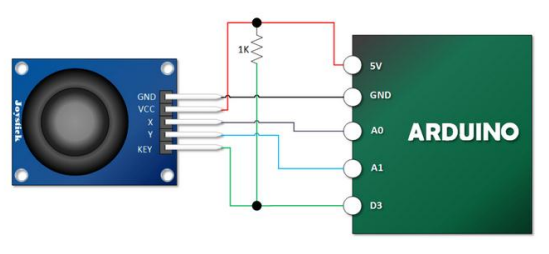

# PS2 Joystick

Simple library for the PS2 Joystick for Arduino.


### Connection diagram



### Methods:

#### Setup
Initialization of the PS2 joystick. TIP: Add pull-up resistors to avoid contact rattling.
```cpp
void initJoystick(uint8_t analog_x, uint8_t analog_y, uint8_t digital_button);
```

#### Button state
Returns a boolean value: true (1) if not pressed, false (0) if pressed.
```cpp
bool getJoyButton(void);
```

#### X axis
Returns X axis.
```cpp
uint16_t getJoyX(void);
```

#### Y axis
Returns Y axis.
```cpp
uint16_t getJoyY(void);
```
